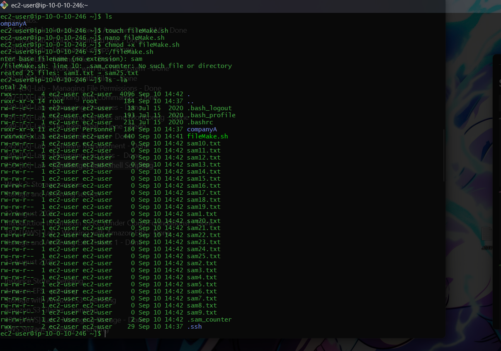

# File Batch Creation Challenge: Complete Solution Guide


## Profile
- **Model**: Qwen2.5-Coder-32B-Instruct
- **Time**: 5:15 pm
- **Status**: Thinking and Searching Completed

---

## Problem Statement
Write a Bash script that meets these requirements:

- Creates **25 empty (0 KB) files** per execution using `touch`
- File names follow pattern: `<yourname><number>.txt` (e.g., `kenpachi1.txt`, `kenpachi2.txt`)
- Continues numbering from last created file on subsequent runs
- No hard-coded numbers — must auto-detect sequence position
- Must work reliably across multiple executions
- Test the script with directory listing validation

---

## Initial Solution Attempt
- Added the ability for a user to enter their own file name
- I added a mandatory file extension of .txt

```bash
#!/bin/bash
echo "Enter your base file name (without extension):"
read filename
if [ -z "$filename" ]; then
  echo "Filename cannot be empty. Exiting."
  exit 1
fi

echo "Hello, this script will create $filename!"
LAST_NUMBER_FILE="last_printed_number.txt"
start_number=1
if [ -f "$LAST_NUMBER_FILE" ]; then
    start_number=$(cat "$LAST_NUMBER_FILE")
    start_number=$((start_number + 1))
fi

end_number=$((start_number + 24))
for i in $(seq "$start_number" "$end_number"); do
     touch "$filename$i.txt"
done

echo "$end_number" > "$LAST_NUMBER_FILE"
```

### Critical Issues Identified
- **Global counter file**
  - One counter file (`last_printed_number.txt`) causes conflicts when multiple base names are used
- **Counter logic error**
  - Stores last created number instead of next start value
  - Crashed at filename100.txt and could not execute the next batch.
- **Line ending problems**
  - Carriage returns (`\r`) cause arithmetic failures
- **Inefficient implementation**
  - Uses `seq` instead of arithmetic loop
- **No input validation** during user prompt


---

## Evolution of the Solution

### Step 1: Per-Base-Name Counter File
```bash
counter=".${filename}_counter"
start=$(<"$counter" 2>/dev/null || echo 1)
end=$((start + 24))
```
- Each base name gets its own hidden counter file
- Prevents conflicts between `test` and `demo`

### Step 2: Correct Counter Logic
```bash
echo $((end + 1)) > "$counter"
```
- Store **next start value**, not last created value

### Step 3: Handle Line Ending Issues
```bash
start=$(tr -d '\r' < "$counter" 2>/dev/null || echo 1)
printf "%d" $((end + 1)) > "$counter"
```
- `tr -d '\r'` removes carriage returns
- `printf` ensures clean integer writes

---

## Final Solution
```bash
#!/bin/bash
# fileBoom.sh
# Creates sequential batches of 25 empty files with auto-incrementing numbers

batch_size=25
while [ -z "$filename" ]; do
    read -rp "Enter base filename (no extension): " filename
done

counter=".${filename}_counter"
# Read counter value safely (remove carriage returns)
start=$(tr -d '\r' < "$counter" 2>/dev/null || echo 1)
end=$((start + batch_size - 1))

# Create batch of files
for ((i = start; i <= end; i++)); do
    touch "${filename}${i}.txt"
done

# Store next starting position
printf "%d" $((end + 1)) > "$counter"
echo "Created $batch_size files: ${filename}${start}.txt → ${filename}${end}.txt"
```

---

## Testing Validation

### First Execution
```bash
$ ./fileBoom.sh
Enter base filename (no extension): test
Created 25 files: test1.txt → test25.txt
```

### Second Execution
```bash
$ ./fileBoom.sh
Enter base filename (no extension): test
Created 25 files: test26.txt → test50.txt
```

### Third Execution
```bash
$ ./fileBoom.sh
Enter base filename (no extension): test
Created 25 files: test51.txt → test75.txt
```

---
### Result

---

## Critical Implementation Details

1. **Counter Management Strategy**
   - Per-base-name counters: `.test_counter` vs `.demo_counter`
   - Next-value storage ensures seamless continuation
   - Carriage return handling for cross-platform compatibility

2. **Arithmetic Precision**
   ```bash
   end=$((start + batch_size - 1))
   ```
   - Subtracting `1` ensures exactly 25 files created

3. **Safe File Operations**
   - `tr -d '\r'` prevents arithmetic errors
   - `printf "%d"` avoids file corruption

---

## Common Pitfalls & Fixes

- **Hardcoded batch size** → Use `batch_size` variable
- **Line ending inconsistencies** → Use `printf` instead of `echo`

---

## Key Takeaways
- State persistence must match use case (per-base-name counters)
- Store **next expected value** not last created value
---

## Verification Checklist
✅ Creates exactly 25 files per execution
✅ Numbering continues across executions
✅ Works with different base names
✅ No hard-coded numbers
✅ Provides clear user feedback
✅ Hidden counter files reduce clutter

---

## Real-World Applications
- Log file rotation systems
- Batch processing of data files
- Creating test data sets
- Automated backup naming schemes
- Any sequential file naming with persistence
